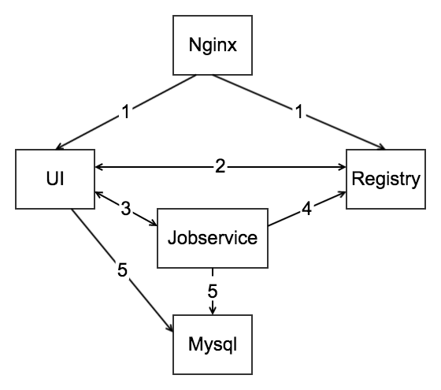
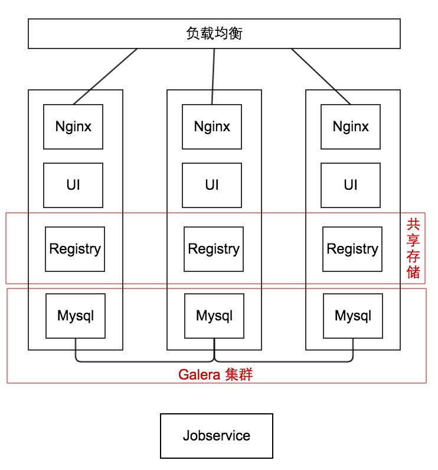
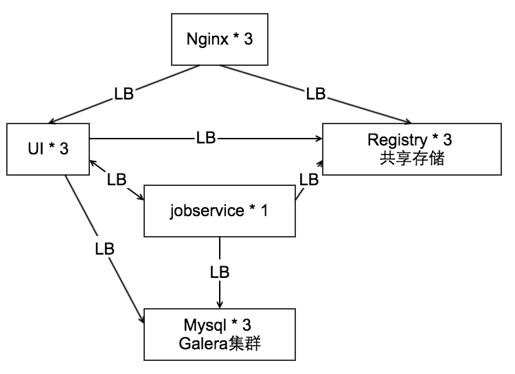

#### Harbor 基本架构

Harbor 各个组件的用处：  
- Nginx：负责请求转发。以 / v2 / 开始的 path 会被转发到 Registry 中，其它请求由 ui 处理  
- UI：Harbor 的主体，提供 Web UI 和 RESTful API  
- Jobservice：提供多个 Harbor 实例之间的镜像同步功能  
- Registry：Docker 镜像仓库  
- Mysql：存储 UI 和 Jobservice 所需要的数据  

Harbor 组件关系：  
（1）Nginx 负责提供 Harbor 实例的入口，所有请求由 Nginx 转发给 UI 和 Registry  
（2）Registry 需要 Authorization（JWT），该 Token 由 UI 生成，同时 UI 的部分 API 需要调用 Registry 的 API  
（3）用户可以通过 UI 创建同步任务，将镜像从当前 Harbor 实例复制到其它 Harbor 实例。UI 只创建任务，Jobservice 负责执行任务  
（4）Jobservice 在同步过程中需要使用 Registry 的 API 获取镜像的 Manifest 和 Blob
（5）UI 和 Jobservice 的数据均存储于 Mysql 中

#### Harbor 高可用方案
为了保证整个 Harbor 实例的高可用，除 Jobservice 以外的组件均扩展为 3 个。  
Jobservice 负责同步镜像，目前还不支持多实例并行同步。因此在方案中只能使用一个。  
即 3Nginx+3UI+3Registry+3Mysql+1Jobservice 模式。  

（1）Galera 集群 + 共享存储 + 独立模式

在该方案中，3 个 Harbor 实例的 Registry 共享一个底层存储。这个存储可以是 NFS 或者其它分布式文件系统。
而 Mysql 由于不能共享存储，因此使用 Galera 多主集群实现数据同步。

（2）Galera 集群 + 共享存储 + 备份模式

在该方案中，依然使用 Galera 集群和共享存储，但是各个组件相互独立，每个组件都有几个备份，通过负载均衡实现高可用（使用 Kubernetes Service 非常容易实现 LB）。
