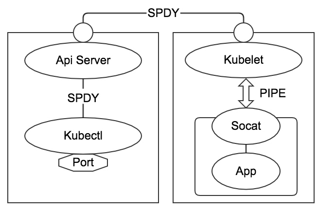

使用 kubectl 创建 port-forward 后，kubectl 会主动监听指定的本地端口。
```
kubectl port-forward pod-name  local-port:container-port
```
当向 local-port 建立端口连接，并向该端口发送数据，数据经过以下步骤：  
1. 数据发往 kubctl 监听的 local-port
2. kubectl 使用事先建立的与 ApiServer:8080 的链接，通过 SPDY 协议将数据发送给 ApiServer
3. ApiServer 使用事先建立的与目标 pod 所在的 node 的 Kubelet 链接，通过 SPDY 协议将数据发送到目标 node
4. 目标 node 的 Kubelet 收到数据后，通过 PIPE（STDIN，STDOUT）与 Socat 通信
5. Socat 将 STDIN 的数据发送给 pod 内部的指定的 container-port，并将返回的数据写入到 STDOUT
6. STDOUT 的数据由 Kubelet 接收并按照相反的路径发送回去

* 注：SPDY 协议将来可能会被替换为 HTTP/2*

#### nsenter 与 socat
[nsenter](https://github.com/jpetazzo/nsenter) 可以将指定的程序放置到另一个进程的 Namespace 中运行
```
 -t, --target <pid>     target process to get namespaces from
 -m, --mount[=<file>]   enter mount namespace
 -u, --uts[=<file>]     enter UTS namespace (hostname etc)
 -i, --ipc[=<file>]     enter System V IPC namespace
 -n, --net[=<file>]     enter network namespace
 -p, --pid[=<file>]     enter pid namespace
 -C, --cgroup[=<file>]  enter cgroup namespace
 -U, --user[=<file>]    enter user namespace
 -S, --setuid <uid>     set uid in entered namespace
 -G, --setgid <gid>     set gid in entered namespace
     --preserve-credentials do not touch uids or gids
 -r, --root[=<dir>]     set the root directory
 -w, --wd[=<dir>]       set the working directory
 -F, --no-fork          do not fork before exec'ing <program>
```
例如，将 netstat 放置到与指定 PID 的进程相同的 net namespace 中运行：
```
nsenter -t $PID -n netstat
```
即可输出 PID 所在的 net namespace 的链接情况。  

socat 可以实现流的代理与转发：
```
-,STDIN,STDOUT ：表示标准输入输出，可以就用一个横杠代替
/var/log/syslog : 打开一个文件作为数据流。
TCP:: : 建立一个 TCP 连接作为数据流，TCP 也可以替换为 UDP
TCP-LISTEN: : 建立 TCP 监听端口，TCP 也可以替换为 UDP
EXEC: : 执行一个程序作为数据流。
```
例如：
```
socat - TCP4:localhost:80
```
即可实现写入 STDIN 的数据发往 localhost:80，localhost:80 的数据输出到 STDOUT。  

#### Kubelet 与容器的通信
Kubelet 同时使用了 nsenter 和 socat 的功能：
```
nsenter -t $PID -n socat - TCP4:localhost:80
```
其中 $PID 为容器在 host 上的进程 ID。并且 socat 与 $PID 在同一个 net namespace 中，因此 localhost 即是容器内部的地址。  
发送到 STDIN 的数据会经由 socat 发送到容器内部的 80 端口中，而 80 端口返回的数据则由 socat 输出到 STDOUT 中。  
Kubelet 在调用该命令时，获取了命令的 STDIN 和 STDOUT 流，将数据写入 STDIN，并从 STDOUT 读取返回的数据，以此实现 Kubelet 与容器的通信。 
