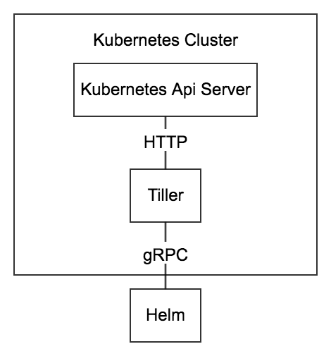

#### Helm Chart 简介
Helm 是一个用于 Kubernetes 的包管理工具。  
每个包称为一个 Chart，一个 Chart 是一个目录（一般情况下会将目录进行打包压缩，形成 name-version.tgz 格式的单一文件，方便传输和存储）。  
一个 Chart 是 Kubernetes 部署文件的集合，使用 Chart 可以方便的在 Kubernetes 中部署一组应用。  

#### Helm 组件
##### Helm：
Helm 是一个 cli 客户端，可以完成如下内容：
- 创建 Chart
- 打包 Chart，打包成 name-version.tgz 格式
- 调试 Chart 
- 创建本地 Chart 仓库
- 管理本地和远程 Chart 仓库
- 与 Tiller 通信并完成 Chart 的安装，升级，删除，回滚，查看等操作

##### Tiller
Tiller 是一个 Chart 管理服务端，Tiller 接收 Helm 的请求，并根据 Chart 生成 Kubernetes 的部署文件（称为一个 Release），然后提交给 Kubernetes 创建应用。  
Tiller 有如下功能：
- 监听来自 Helm 的请求
- 根据请求提交的 Chart 与 Config 生成一个 Release
- 将 Release 提交给 Kubernetes，并且跟踪 Release 的状态
- 提供 Release 的升级，删除，回滚等功能

#### Helm 通信过程

Chart Install 过程：  
1. Helm 从指定的目录或者 tgz 文件中解析出 Chart 结构信息
2. Helm 将指定的 Chart 结构和 Values 信息通过 gRPC 传递给 Tiller
3. Tiller 根据 Chart 和 Values 生成一个 Release
4. Tiller 将 Release 发送给 Kubernetes 用于生成 Release

Chart Update 过程：
1. Helm 从指定的目录或者 tgz 文件中解析出 Chart 结构信息
2. Helm 将要更新的 Release 的名称和 Chart 结构，Values 信息传递给 Tiller
3. Tiller 生成 Release 并更新指定名称的 Release 的 History
4. Tiller 将 Release 发送给 Kubernetes 用于更新 Release

Chart Rollback 过程：
1. Helm 将要回滚的 Release 的名称传递给 Tiller
2. Tiller 根据 Release 的名称查找 History
3. Tiller 从 History 中获取上一个 Release
4. Tiller 将上一个 Release 发送给 Kubernetes 用于替换当前 Release

**Chart 依赖说明 **：  
Tiller 在处理 Chart 时，直接将 Chart 以及其依赖的所有 Charts 合并为一个 Release，同时传递给 Kubernetes。因此 Tiller 并不负责管理依赖之间的启动顺序。Chart 中的应用需要能够自行处理依赖关系。
