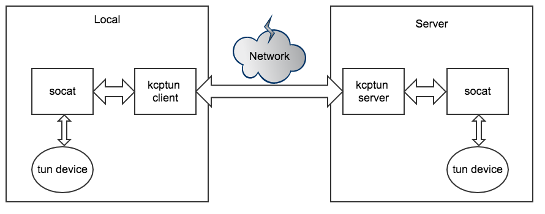

### 工具简介
socat 是一个流重定向工具，例如可以将一个文件流通过 tcp 发送出去。本文主要使用 socat 的 tun 转发功能。  
socat 可以使用如下命令安装：
```
yum install -y socat
```

[kcptun](https://github.com/xtaci/kcptun) 是一个使用 udp 代替 tcp 的数据承载工具。在较差的网络环境中可以用带宽换时延，提高网络速度。  
kcptun 是一个基于 kcp 协议的开源 tunnel 项目，可以在 [Github](https://github.com/xtaci/kcptun/releases) 下载，注意选择系统版本 。

### 工作原理


1. socat 创建 tun 设备，并读取 tun 设备的所有 ip 数据包，将数据包发送至另一端。
2. 原则上 socat 客户端与 socat 服务端之间可以不使用 kcptun ， socat 客户端可以直接与 socat 服务端通信。
3. 使用 kcptun 的目的是提高客户端与服务端之间的通信效率。

### 配置
#### 服务端：
```
# 启动 socat ，监听 tcp 5001 端口，设置 tun 设备 ip 地址为 10.0.0.1/24
nohup socat -d -d TCP-LISTEN:5001,reuseaddr TUN:10.0.0.1/24,up > socat.out 2>&1 &

# 启动 kcptun ，监听 udp 5000 端口， 把数据都转发给 127.0.0.1:5001
# 此处 kcptun 使用的是 linux/amd64 版本
nohup ./server_linux_amd64 -t 127.0.0.1:5001 -l :5000 -mode fast2 & > kcptun.out 2>&1 &
```

增加 iptables 规则：
```
# eth0 是服务器的外网网卡，根据服务器的网卡情况设置
# 这条规则用于伪装 tun 的数据包
iptables -t nat -A POSTROUTING -s 10.0.0.0/24 -o eth0 -j MASQUERADE
```

#### 客户端：
```
# 启动 kcptun ， 监听 tcp 5001 端口， 把数据都转发给 服务器 IP:5000 
nohup ./client_linux_amd64  -r 服务器 IP:5000 -l :5001 -mode fast2 > kcptun.out 2>&1 &

# 启动 socat ，将 tun 设备所有数据包发送至 127.0.0.1:5001
nohup socat TCP:127.0.0.1:5001 TUN:10.0.0.2/24,up > socat.out 2>&1 &

```

增加 iptables 规则：
```
# tun0 是 socat 创建的 tun 网卡，需要根据实际情况设置
# 这条规则用于伪装 tun 的数据包
iptables -t nat -A POSTROUTING  -o tun0 -j MASQUERADE
```

#### 客户端路由设置
如果没有设置客户端的路由，那么只能访问 10.0.0.1 。  
ping 10.0.0.1 的情况:
```
ping -I tun0 10.0.0.1
PING 10.0.0.1 (10.0.0.1) from 10.0.0.2 tun0: 56(84) bytes of data.
64 bytes from 10.0.0.1: icmp_seq=1 ttl=64 time=276 ms
64 bytes from 10.0.0.1: icmp_seq=2 ttl=64 time=272 ms
64 bytes from 10.0.0.1: icmp_seq=3 ttl=64 time=278 ms
64 bytes from 10.0.0.1: icmp_seq=4 ttl=64 time=270 ms

--- 10.0.0.1 ping statistics ---
4 packets transmitted, 4 received, 0% packet loss, time 3003ms
rtt min/avg/max/mdev = 270.519/274.514/278.211/3.022 ms
```
这个 IP 是服务端的 tun0 的 IP 地址，客户端的 socat 在创建 tun0 的同时会加上一个对应 10.0.0.0/24 的路由，所以 10.0.0.1 能够正常访问。路由如下：
```
10.0.0.0/24 dev tun0  proto kernel  scope link  src 10.0.0.2 
```

ping 8.8.8.8 的情况：
```
ping -I tun0 8.8.8.8
PING 8.8.8.8 (8.8.8.8) from 10.0.0.2 tun0: 56(84) bytes of data.

--- 8.8.8.8 ping statistics ---
6 packets transmitted, 0 received, 100% packet loss, time 5000ms
```
在客户端通过 tcpdump 确认 tun0 能正常的从 socat 发出并收到服务端的 IP 报文。ip -s addr show tun0 的 RX 和 TX 显示 IP 报文正常接收，没有错误，也没有 drop，但是无法被发出 IP 报文的应用程序接收。

添加对应 IP 的路由后，即可正常访问这些 IP ：
```
# 8.8.0.0/16 网段的 ip 都会通过 tun0 转发，根据实际需要设置路由即可
ip route add 8.8.0.0/16 dev tun0
```
