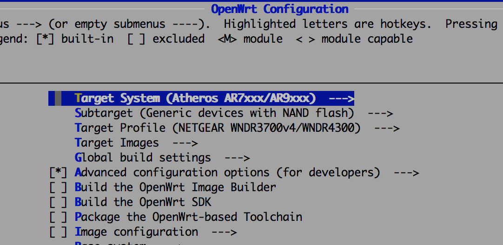
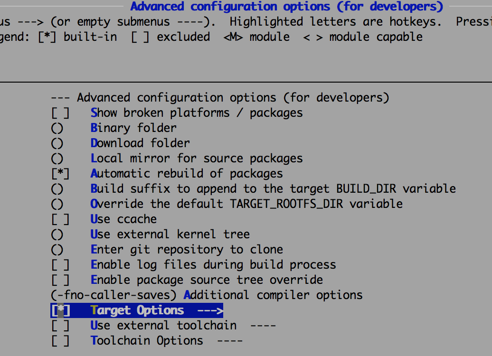
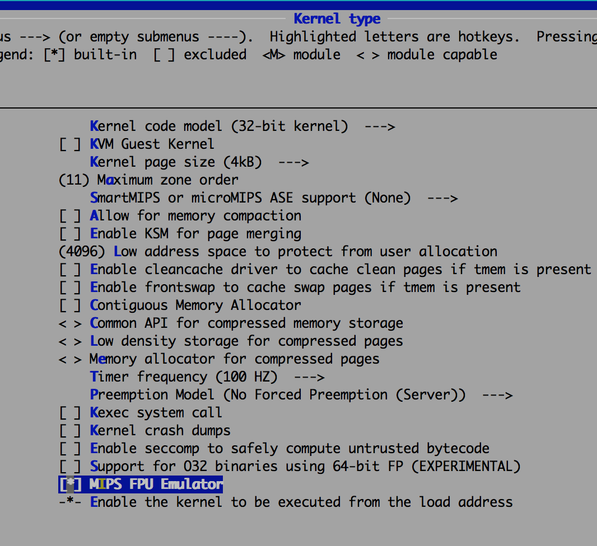
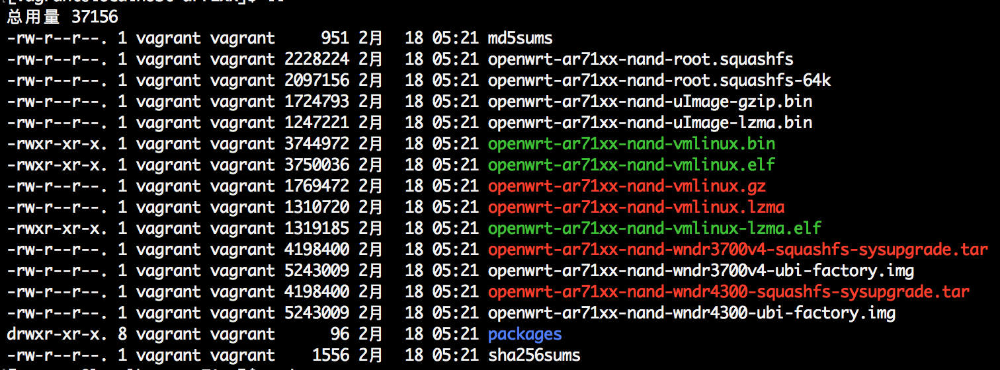

#### 编译环境
系统版本：CentOS Linux release 7.3.1611 (Core)  
内核版本：3.10.0-514.2.2.el7.x86\_64

** 注意事项：整个过程需要在非 root 用户环境下进行。同时在编译过程中需要下载大量内容，如果网络不畅，则需要使用 http/https 代理。**

安装编译过程必须的软件：
```
sudo yum install epel-release
sudo yum install subversion binutils bzip2 gcc gcc-c++ gawk gettext flex ncurses-devel zlib-devel zlib-static make patch unzip perl-ExtUtils-MakeMaker glibc glibc-devel glibc-static quilt ncurses-libs sed sdcc intltool sharutils bison wget git-core openssl-devel xz
```

下载 openwrt 源码，并切换到稳定的分支（此处使用当前最新版本 v15.05.1）：
```
git clone https://github.com/openwrt/openwrt.git
cd ./openwrt
git checkout -b build v15.05.1
```

#### 构建
1. 更新并安装 feeds ：
```
./scripts/feeds update -a
./scripts/feeds install -a
```

2. 编译选项：
* 路由器是 [netgear wndr4300 v1](https://wiki.openwrt.org/toh/netgear/wndr4300)
```
make menuconfig
```

基本配置为开头的三项，分别设置为：  
- Atheros AR7xxx/AR9xxx
- Generic devices with NAND flash
- NETGEAR WNDR3700v4/WNDR4300 



开启 Advanced configuration options (for developer) 中的 Target Options:



开启该选项后，该选项的子选项 Use software floating point by default 也会被打开。


* 为了支持 [golang 1.8](https://golang.org/doc/go1.8#ports) 需要打开内核 FPU 模拟
```
# 使用这个命令时会编译部分文件并去下载 kernel 源码，因此需要等待一段时间。
# 开启 Kernel Type -> MIPS FPU Emulator
make kernel_menuconfig
```


3. 编译
```
# 启用多个线程进行编译，通常设置成和 cpu 核心数一样
make -j8
```
编译需要一定的时间，编译完成后即可在 **openwrt/bin/ar71xx** 目录中找到相应的镜像文件：

其中 **openwrt-ar71xx-nand-wndr4300-ubi-factory.img** 是首次刷机使用的镜像，**openwrt-ar71xx-nand-wndr4300-squashfs-sysupgrade.tar** 是已刷机的路由器使用的升级镜像。

#### 安装
1. 打开路由器管理页面，在固件升级页面中选择上传 **openwrt-ar71xx-nand-wndr4300-ubi-factory.img** 镜像，然后开始安装固件。  

2. 安装完成后使用如下命令连接路由器（此时可能无法访问路由器 web 页面）：
```
# 在 cmd 或者 terminal 中输入该命令
# 路由器默认 ip 为 192.168.1.1
telnet 192.168.1.1
# 修改 root 账户密码
passwd
# 输入完成密码后退出
exit
# 更改 root 密码之后 telnet 就会被禁用，无法再使用 telnet 连接
# 使用 ssh 连接路由器
ssh root@192.168.1.1
```
3. 安装必要软件
```
# 更新软件仓库信息
opkg update
# 安装路由器 Web 管理工具 luci
# 此处也可以改为 luci-ssl 以增加 https 的支持
opkg install luci 
# 安装语言包
opkg install luci-i18n-base-zh-cn
```
4. 启动 Web 服务
```
# 设置为开机启动
/etc/init.d/uhttpd enable
# 启动服务
/etc/init.d/uhttpd start
```
之后即可通过浏览器访问并管理路由器。
